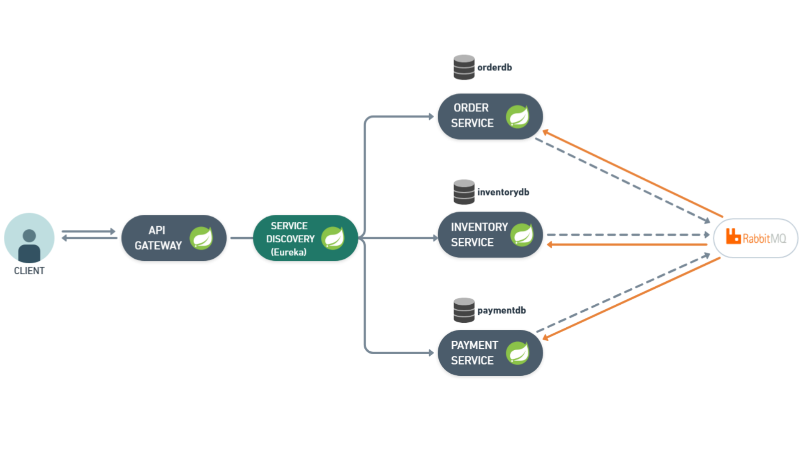

# Microserviços - Processamento de Pedidos

---

## 📋 Sobre:

Este projeto faz parte do backend de um Sistema de Processamento de pedidos, que tem como o objetivo Simular um fluxo de compra em um e-commerce, onde cada etapa (pedido, estoque, pagamento, notificação) é realizada por microsserviços independentes que se comunicam de forma assíncrona via mensagens.

## 💻 Tecnologias:

- Java 17
- Spring Boot 3.5.4
- Spring Data JPA
- Spring Cloud Webflux
- RabbitMQ
- Eureka
- PostgreSQL
- H2
- Lombok
- MapStruct
- Swagger
- SLF4J
- Spring Actuator
- Docker

## ⚙️ Como funciona:



### Order Service:

- Cria novos pedidos e os persiste.
- Publica a mensagem na fila **`order-created.ms`**.
- Atualiza o status conforme mensagens recebidas.
- Escuta as filas: **`payment-status.ms`** e **`inventory-status-order.ms`**.

🔗 Endpoints:

- `POST /order`
- `GET /order`
- `GET /order/{id}`

### Inventory Service

- Gerencia produtos do estoque (Verifica disponibilidade,
  atualiza estoque e adiciona produtos).
- Escuta a queue **`order-created.ms`**, recebe, e analisa o pedido.
- Emite uma mensagem com status do pedido para **`inventory-status-order.ms**`** e **`inventory-status-payment.ms`\*\*.

Endpoints:

🔗 Endpoints:

- `POST /product`
- `GET /product`
- `GET /product/{id}`

### Payment Service

- Processa o pagamento de pedidos.
- Escuta **`inventory-status-payment.ms`**.
- Emite mensagem para: **`payment-status.ms`**.

🔗 Endpoints:

- `GET /payment`
- `GET /payment/{id}`

### API-Gateway

- Centraliza e roteia todas as requisições.
- Usa Discovery com Eureka para mapear os serviços automaticamente.

### Service Discovery

- Controla a instância dos microsserviços e faz o balanceamento.

## 🔧 Execução do Projeto:

### Requisitos:

- Docker
- Java 17 (Para desenvolvimento)
- Maven 4.0.0 (Para desenvolvimento)

### 1. Execução geral via docker-compose:

Basta executar o comando no diretório raiz do repositório:

```
docker-compose up --build
```

### 2. Executando manualmente via CLI (Desenvolvimento)

- Clone o repositório e rode os serviços em ordem na sua IDE - Discovery-Service -> Serviços\* -> API-Gateway
- Ele irá utilizar o banco em memória H2 para rodar.

> Use o perfil:  
> `SPRING_PROFILES_ACTIVE=dev`  
> Isso usará o banco em memória (H2) e ignora dependências Docker (PostgreSQL/RabbitMQ)

---

### 🔍 Endpoints

🔗 API Gateway (Docker):

- `http://localhost:8080/order`
- `http://localhost:8080/product`
- `http://localhost:8080/payment`

🔗 Desenvolvimento (Direto por porta):

- `http://localhost:8081/order`
- `http://localhost:8082/product`
- `http://localhost:8083/payment`

### 🧪 Swagger (Desenvolvimento):

Acesse a documentação das APIs quando a aplicação for rodada em **Desenvolvimento** pelos seus endpoits:

- `http://localhost:8081/swagger-ui/index.html`
- `http://localhost:8082/swagger-ui/index.html`
- `http://localhost:8083/swagger-ui/index.html`

<div align="center">

---

⭐ Se este projeto te ajudou, considere dar uma estrela!

[ Voltar ao topo](#sobre)

</div>
